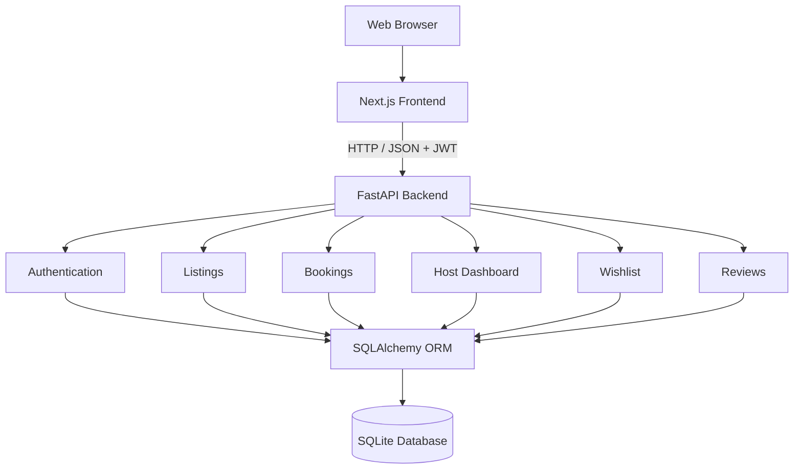

# StayNest — Full-Stack Accommodation Marketplace

StayNest is a full-stack accommodation marketplace built as an academic and portfolio project. It provides a complete guest and host workflow: authentication, property discovery, availability checking, booking, mock checkout, trips, wishlists, reviews, host management, and interactive maps.

The application is split into a **Next.js frontend** and a **FastAPI backend**, with SQLite used for local development and a persistent SQLite volume supported for the Railway deployment configuration.

## Features

### Guest
- Register and log in as a guest
- Browse and search accommodation listings
- Filter by location, price, category, amenities, dates, and guest capacity
- View detailed property pages, image galleries, amenities, reviews, availability, and maps
- Reserve available dates with server-side validation
- Server-side booking price calculation
- Mock checkout and booking confirmation
- View upcoming, completed, and cancelled trips
- Cancel reservations
- Save and remove properties from a persistent wishlist
- Submit reviews only for eligible stays

### Host
- Register and log in as a host
- View host dashboard statistics
- Create accommodation listings
- Edit owned listings
- Add amenities and image URLs
- View guest reservations
- Deactivate listings without deleting historical booking/review records

### Backend
- JWT authentication and role-based authorization
- bcrypt password hashing
- SQLAlchemy ORM
- Relational SQLite schema with foreign keys and constraints
- Booking overlap protection
- SQLite `BEGIN IMMEDIATE` transaction locking for concurrent booking attempts
- Server-side pricing
- Persistent wishlist and review data
- 18 API integration tests

### Frontend
- Next.js App Router + TypeScript
- Tailwind CSS
- Responsive desktop/tablet/mobile layouts
- Reusable UI components
- Toast notifications and confirmation modals
- Leaflet interactive maps
- Dynamic API integration with FastAPI

---

## Technology Stack

| Layer | Technology |
|---|---|
| Frontend | Next.js, React, TypeScript, Tailwind CSS |
| UI / Icons | Lucide React |
| Maps | Leaflet |
| Backend | FastAPI, Python 3.12+, Uvicorn |
| ORM | SQLAlchemy |
| Database | SQLite |
| Authentication | JWT + bcrypt |
| Validation | Pydantic |
| Testing | pytest + FastAPI TestClient |
| Local API | `http://localhost:8000` |
| Local Frontend | `http://localhost:3000` |

---

## Architecture



---

## Project Structure

```text
StayNest/
├── backend/
│   ├── app/
│   │   ├── auth.py
│   │   ├── database.py
│   │   ├── main.py
│   │   ├── models.py
│   │   ├── schemas.py
│   │   └── routers/
│   │       ├── auth.py
│   │       ├── bookings.py
│   │       ├── host.py
│   │       ├── listings.py
│   │       └── wishlist.py
│   ├── tests/
│   │   └── test_api.py
│   └── requirements.txt
│
├── frontend/
│   ├── src/
│   │   ├── app/
│   │   ├── components/
│   │   ├── context/
│   │   ├── lib/
│   │   └── types/
│   ├── package.json
│   └── package-lock.json
│
├── .env.example
├── .gitignore
├── pytest.ini
└── README.md
```

> The local SQLite database file is intentionally ignored by Git. It should not be committed to the repository.

---

## Environment Variables

Create local environment files from `.env.example`.

### Backend

```env
DATABASE_URL=sqlite:///./airbnb.db
JWT_SECRET=replace-with-a-strong-random-secret
FRONTEND_URL=http://localhost:3000
```

### Frontend

```env
NEXT_PUBLIC_API_URL=http://localhost:8000
```

### Important

- Never commit `.env` or `.env.local`.
- Never put `JWT_SECRET` in frontend variables.
- `NEXT_PUBLIC_API_URL` is public and contains only the backend API URL.
- For production, use a strong unique `JWT_SECRET` configured directly in Railway.

---

# Local Development

## 1. Backend Setup

From the project root:

```powershell
cd backend
python -m venv venv
.\venv\Scripts\activate
pip install -r requirements.txt
```

Create the backend environment configuration as required by the application.

Start FastAPI:

```powershell
uvicorn app.main:app --reload --host 127.0.0.1 --port 8000
```

API:

```text
http://localhost:8000
```

Swagger documentation:

```text
http://localhost:8000/docs
```

## 2. Frontend Setup

Open a second terminal from the project root:

```powershell
cd frontend
npm install
npm run dev
```

Frontend:

```text
http://localhost:3000
```

The frontend reads the backend URL from:

```env
NEXT_PUBLIC_API_URL=http://localhost:8000
```

---

# Database & Seed Data

The project uses SQLite for local development.

Local database:

```text
airbnb.db
```

Production deployment:

```text
/data/airbnb.db
```

The seed process creates sample users, listings, images, amenities, bookings, reviews, and related data.

### Important

The seed script is **destructive**: it can recreate/reset database data.

Therefore:

- Run it manually when initializing a fresh database.
- Do not configure it as a Railway build or release command.
- Never run it automatically on every deployment.

---

# Booking Safety

## Overlap Detection

A booking is rejected when an active booking overlaps the requested date range:

```python
existing.check_in < requested_check_out
and existing.check_out > requested_check_in
```

Cancelled bookings do not block availability.

Adjacent stays are allowed.

Example:

```text
Existing:  Sep 1 → Sep 5
New:       Sep 5 → Sep 10
Result:    Allowed
```

## Concurrent Booking Protection

The backend uses:

```sql
BEGIN IMMEDIATE
```

before the availability check and booking write.

This prevents two simultaneous booking requests from both passing the availability check against the same SQLite database state.

## Server-Side Pricing

The frontend does not control the final booking amount.

The backend calculates:

```text
nights = checkout - check_in

subtotal = nightly_price × nights

cleaning_fee = subtotal × 15%

service_fee = subtotal × 10%

total = subtotal + cleaning_fee + service_fee
```

---

# Security

- JWT-based authentication
- bcrypt password hashing
- Guest/host role separation
- Host ownership checks for listing management
- Guest ownership checks for trips
- Persistent wishlist isolation by authenticated user
- Review eligibility validation
- Backend-side booking validation
- Foreign-key constraints
- Unique database constraints
- Production CORS controlled through `FRONTEND_URL`

---

# API Overview

## Authentication

| Method | Endpoint | Auth |
|---|---|---|
| POST | `/api/auth/register` | Public |
| POST | `/api/auth/login` | Public |
| GET | `/api/auth/me` | JWT |

## Listings

| Method | Endpoint | Auth |
|---|---|---|
| GET | `/api/listings` | Public |
| GET | `/api/listings/{id}` | Public |
| GET | `/api/listings/{id}/availability` | Public |
| POST | `/api/listings` | Host |
| PUT | `/api/listings/{id}` | Host |
| DELETE | `/api/listings/{id}` | Host |

## Bookings

| Method | Endpoint | Auth |
|---|---|---|
| POST | `/api/bookings` | Guest |
| GET | `/api/bookings/my-trips` | Guest |
| GET | `/api/bookings/{id}` | Guest |
| POST | `/api/bookings/{id}/cancel` | Guest |

## Host

| Method | Endpoint | Auth |
|---|---|---|
| GET | `/api/host/listings` | Host |
| GET | `/api/host/bookings` | Host |

## Wishlist

| Method | Endpoint | Auth |
|---|---|---|
| GET | `/api/wishlist` | JWT |
| POST | `/api/wishlist/{listing_id}` | JWT |
| DELETE | `/api/wishlist/{listing_id}` | JWT |

## Reviews

| Method | Endpoint | Auth |
|---|---|---|
| GET | `/api/listings/{id}/reviews` | Public |
| POST | `/api/listings/{id}/reviews` | Guest |

---

# Testing

## Backend Tests

From the project root:

```powershell
python -m pytest backend/tests/test_api.py
```

Current verification:

```text
18 passed
0 failures
0 warnings
```

## Frontend Production Build

From `frontend/`:

```powershell
npm run build
```

The production build has been verified successfully with no compile errors or warnings.

---

# Deployment

## Backend — Railway

Recommended repository root:

```text
/
```

Start command:

```bash
uvicorn backend.app.main:app --host 0.0.0.0 --port $PORT
```

Configure these Railway variables:

```env
JWT_SECRET=<strong-production-secret>
DATABASE_URL=sqlite:////data/airbnb.db
FRONTEND_URL=https://<your-vercel-domain>
```

Attach a Railway persistent volume:

```text
/data
```

This keeps the SQLite database persistent across deployments/restarts.

### Important

Do **not** run the destructive seed script automatically during deployment.

After the backend is deployed, verify:

```text
https://<your-railway-domain>/docs
```

---

## Frontend — Vercel

Set the Vercel project root directory to:

```text
frontend
```

Vercel should detect Next.js automatically.

Configure:

```env
NEXT_PUBLIC_API_URL=https://<your-railway-domain>
```

Deploy the frontend after the Railway backend URL is available.

Finally, update Railway:

```env
FRONTEND_URL=https://<your-vercel-domain>
```

This allows the production backend to accept requests from the deployed frontend.

---

# Deployment Order

Use this order to avoid configuration issues:

```text
1. Push StayNest to GitHub
        ↓
2. Deploy FastAPI backend to Railway
        ↓
3. Attach Railway volume at /data
        ↓
4. Configure Railway environment variables
        ↓
5. Generate Railway public domain
        ↓
6. Deploy Next.js frontend to Vercel
        ↓
7. Set NEXT_PUBLIC_API_URL on Vercel
        ↓
8. Update FRONTEND_URL on Railway
        ↓
9. Run production smoke tests
```

---

# Production Considerations

SQLite + a persistent Railway volume is suitable for this academic/demo deployment, but it has limitations.

### SQLite limitations

- File-level write locking
- Limited concurrent write throughput
- A persistent volume is tied to the service environment
- Not ideal for horizontal application scaling

For a larger production marketplace, migrate `DATABASE_URL` to a managed relational database such as PostgreSQL.

### Payments

Checkout is a **mock payment flow** for demonstration purposes. No real payment provider is connected.

### Images

Listing images currently use external image URLs. A production system should use dedicated object storage such as S3 or Cloudinary.

---

# Project Status

| Area | Status |
|---|---|
| Backend API | Complete |
| Database Models | Complete |
| JWT Authentication | Complete |
| Listings | Complete |
| Booking & Availability | Complete |
| Mock Checkout | Complete |
| Guest Trips | Complete |
| Host Dashboard | Complete |
| Wishlist | Complete |
| Reviews | Complete |
| Leaflet Maps | Complete |
| Responsive UI | Complete |
| Backend Tests | 18/18 Passed |
| Production Build | Passed |
| Railway Deployment | Ready |
| Vercel Deployment | Ready |

---

## License

This project was created for academic, learning, demonstration, and portfolio purposes.
